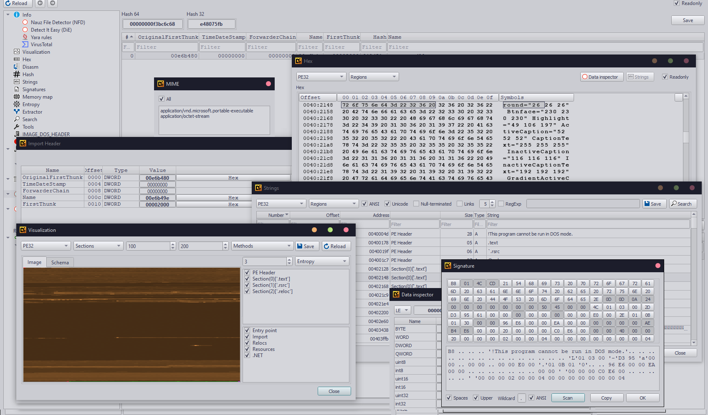

# 🔍 Detect It Easy (DiE)

[](https://www.paypal.com/cgi-bin/webscr?cmd=_s-xclick&hosted_button_id=NF3FBD3KHMXDN)
[](http://ntinfo.biz)
[](http://ntinfo.biz)
[](https://github.com/horsicq/XTranslation)

**Detect It Easy (DiE)** is a powerful tool for file type identification, popular among **malware analysts**, **cybersecurity experts**, and **reverse engineers** worldwide. Supporting both **signature-based** and **heuristic analysis**, DIE enables efficient file inspections across a broad range of platforms, including **Windows, Linux, and MacOS**. Its adaptable, script-driven detection architecture makes it one of the most versatile tools in the field, with a comprehensive list of supported OS images.

> ### 🔗 Let's get started!
> 
> - **[💎 Download release](https://github.com/horsicq/DIE-engine/releases)**
> - **[🧱 Download dev/beta](https://github.com/horsicq/Detect-It-Easy/releases/tag/Beta)**
> - **[🔩 DIE API Library (for Developers)](https://github.com/horsicq/die_library)**
> - [📋 Changelog](https://github.com/horsicq/Detect-It-Easy/blob/master/changelog.txt)
> - [💬 Contribute to Translations](https://github.com/horsicq/XTranslation)
>
> 

---

## 💡 Why use Detect It Easy?

Detect It Easy’s **flexible signature system** and **scripting capabilities** make it an essential tool for **malware analysis** and **digital forensics**. With traditional static analyzers often limited in scope and prone to false positives, DIE’s customizable design enables precise integration of new detection logic, ensuring reliable results across diverse file types.



### Key Advantages:

- **Flexible Signature Management**: DIE’s open architecture allows users to easily create, modify, and optimize signatures, making it adaptable for unique analysis needs.
- **Cross-Platform Support**: Runs seamlessly on Windows, Linux, and MacOS, offering native compatibility for a wide range of OS environments. This flexibility allows it to be deployed across multiple systems, providing a universal solution for analysts.
- **Minimal False Positives**: Combined signature and heuristic analysis ensures reliable detection accuracy, minimizing the potential for false positives in scanning.

---

## 📄 Supported File Types

DIE currently supports an extensive range of executable and archive types, making it highly versatile for different analytical contexts:

- **PE** (Portable Executable format for Windows)
- **ELF** (Executable and Linkable Format for Linux)
- **APK** (Android Application Package)
- **IPA** (iOS Application Package)
- **JAR** (Java Archive)
- **ZIP** (Compressed archives and similar formats)
- **DEX** (Dalvik Executable for Android)
- **MS-DOS** (MS-DOS executable files)
- **COM** (Simple executable format, often for DOS)
- **LE/LX** (Linear Executable for OS/2)
- **MACH** (Mach-O files for MacOS)
- **NPM** (JavaScript packages)
- **Amiga** (Executable format for Amiga computers)
- **Binary** (Other unclassified files)

Unknown formats undergo heuristic analysis, providing identification for both known and unrecognized files. DIE’s compatibility with lesser-known formats like **COM** and **DEX** further underscores its versatility in digital forensics and reverse engineering.

---

## 🔑 Key Features

- **Flexible Signature Management**: With DIE, users can define their own detection signatures or modify existing ones to refine analysis results. This flexibility, along with DIE’s **open signature architecture**, makes it highly adaptable for analyzing both common and rare file types.
  
- **Scripted Detection**: Custom detection algorithms can be created using DIE’s JavaScript-like scripting language. This capability allows advanced users to perform specialized analyses, including deep unpacking and targeted detection routines tailored for complex or encrypted file structures.

- **Cross-Platform Compatibility**: DIE is available for Windows, Linux, and MacOS, with separate GUI and command-line (CLI) versions. This cross-platform support is essential for analysts working in different environments, allowing consistent functionality across systems.

- **Reduced False Positives**: DIE leverages a combination of signature and heuristic scanning to ensure high detection accuracy. This reduces the likelihood of false positives, which is especially important in scenarios where detection precision is critical.

---

## 📥 Installation

### 📦 Install via Package Managers

You can download the program as a portable version from the list of releases. However, if you like the option of using Package Managers, you may want to consider this item.

- **Windows**: [Chocolatey](https://community.chocolatey.org/packages/die) (Thanks to [**chtof**](https://github.com/chtof) and [**Rob Reynolds**](https://github.com/ferventcoder))
- **Linux**: 
  - **Parrot OS**: Package name `detect-it-easy`
  - **Arch Linux**: AUR package [detect-it-easy-git](https://aur.archlinux.org/packages/detect-it-easy-git/)
  - **openSUSE**: [OBS](https://build.opensuse.org/package/show/home:mnhauke/detect-it-easy)
  - **REMnux**: Malware analysis distribution

> [!NOTE]  
> Don't have a computer nearby, but need to scan a file? Use **Detect It Easy** bot via **Telegram** to quickly check files through our server: [**@detectiteasy_bot**](https://t.me/detectiteasy_bot)

### ⚙️ Build from Source

For those who need to build DIE from source, see the [BUILD.md](docs/BUILD.md) for detailed instructions on setting up dependencies and compiling DIE across platforms.

### 🐳 Docker Installation

Easily run DIE in a Docker container, providing a secure, isolated environment for file analysis:

```bash
git clone --recursive https://github.com/horsicq/Detect-It-Easy
cd Detect-It-Easy/
docker build . -t horsicq:diec
```

---

## 🖥️ Usage

Detect It Easy offers three distinct versions to fit different usage scenarios:

- **die** - Graphical interface for intuitive analysis and easy navigation.
- **diec** - Command-line version designed for batch processing and automation, ideal for integration into larger forensic or analysis workflows.
- **diel** - Lightweight GUI version for environments with limited resources, still supporting most core features.

For detailed usage and specific examples, refer to the [RUN.md](docs/RUN.md).

### 🔎 Example Use Cases

- **Malware Analysis**: DIE’s detection capabilities allow for precise identification of file types, packers, or applied protections, a crucial first step in reverse engineering and malware analysis.
- **Security Audits**: DIE can quickly determine executable file types and any potential security risks within unknown files, useful in cybersecurity assessments and vulnerability analysis.
- **Software Forensics**: Analysts can use DIE to inspect software components, identify legacy binaries, or validate compliance in software packages.

## 🏆 Special Thanks

### Thanks to all the people who already contributed!
<a href="https://github.com/horsicq/Detect-It-Easy/graphs/contributors">
    
</a>

And thanks to [PELock Software Protection & Reverse Engineering](https://www.pelock.com)

---

